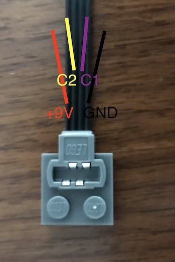
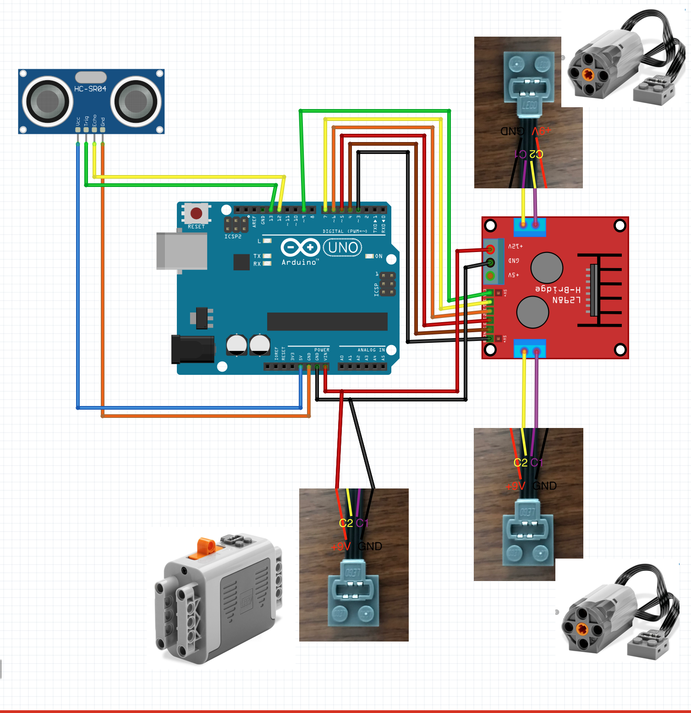

# Arduino-MotorControl

This is a simple project to use L298N with Arduino to drive Lego Power Functions Motors. 

## Parts used

  - Arduino Uno
  - L298N H-Bridge motor driver
  - HC-SR04 Ultrasonic ranging module
  - Lego Technic 42095 :) with 2 Power functions M-Motor(8883) and 1 Power functions battery box(8881)
  - Lego Power functions extention cable(8871) not to damage motor nor battery box
  - A couple of lego parts :)
  
### Important notes on connections

  - Not to damage motor and battery box cables, extention wires will be used to connect Lego parts to circuit components.
  - There are 4 connection cables per Lego connection point. But only 2 of them will be used in this project.
  - To connect Lego Power Functions battery box the outer most 2 cables will used.
  - To connect Lego Power Functions motors the 2 cables in the middle will be used.
  

While connecting Lego Power functions battery box +9V and 0V cables will be used

While connecting Lego Power functions motors C1 and C2 cables will be used

  

References: 
https://www.philohome.com/pf/pf.htm

https://create.arduino.cc/projecthub/Notthemarsian/take-control-over-lego-power-functions-ee0bfa

